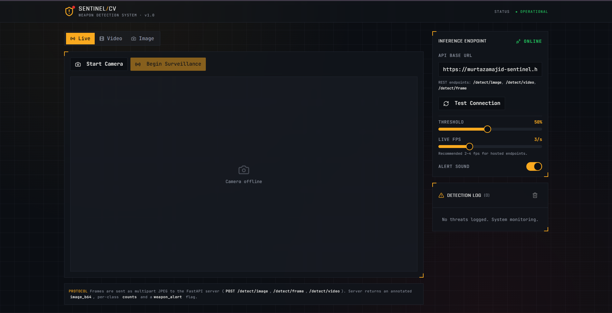

<div align="center">

<br/>

```
███████╗███████╗███╗   ██╗████████╗██╗███╗   ██╗███████╗██╗      █████╗ ██╗
██╔════╝██╔════╝████╗  ██║╚══██╔══╝██║████╗  ██║██╔════╝██║     ██╔══██╗██║
███████╗█████╗  ██╔██╗ ██║   ██║   ██║██╔██╗ ██║█████╗  ██║     ███████║██║
╚════██║██╔══╝  ██║╚██╗██║   ██║   ██║██║╚██╗██║██╔══╝  ██║     ██╔══██║██║
███████║███████╗██║ ╚████║   ██║   ██║██║ ╚████║███████╗███████╗██║  ██║██║
╚══════╝╚══════╝╚═╝  ╚═══╝   ╚═╝   ╚═╝╚═╝  ╚═══╝╚══════╝╚══════╝╚═╝  ╚═╝╚═╝
```

### 🛡️ Real-Time Weapon Detection System

<br/>

[](http://sentinel-ai-real-time-weapon-detection.vercel.app/)
[](https://github.com/ultralytics/ultralytics)
[](https://fastapi.tiangolo.com/)
[](https://universe.roboflow.com/swifeye/weapon-c6q7e)
[](LICENSE)

<br/>

> Detect **weapons, persons, and vehicles** in real time — via image upload, video analysis, or live webcam feed — powered by a custom-trained YOLOv8 model and a FastAPI backend.

---




<br/>

</div>

---

## 📌 What is Sentinel AI?

Sentinel AI is an end-to-end computer vision system for automated threat detection in visual media. It was built to explore how modern object detection models can be fine-tuned for security-sensitive use cases.

The system has three detection modes accessible from a single web interface:

| Mode | How it works |
|------|-------------|
| 📷 **Image** | Upload a photo → get an annotated image with bounding boxes + class labels back instantly |
| 🎞️ **Video** | Upload an MP4/AVI → backend samples frames across the timeline and returns per-frame detections |
| 📡 **Live Webcam** | Browser captures frames every ~300ms and sends them to the API → annotated frames streamed back in near real-time |

A **⚠️ WEAPON ALERT** banner fires automatically whenever a weapon class is detected in any mode.

---

## 🗂️ Repository Structure

```
Sentinel-AI---Real-Time-Weapon-Detection-System-/
│
├── 📁 Models/
│   └── best.pt                        # Trained YOLOv8n weights (best checkpoint)
│
├── 📁 Notebooks/
│   └── Weapon_Detection_System.ipynb  # Full training pipeline (Google Colab)
│
└── 📁 Web Application/
    ├── app.py                         # FastAPI backend — 3 inference endpoints
    ├── requirements.txt               # Python dependencies
    ├── Dockerfile                     # For HuggingFace Spaces (Docker SDK)
    └── render.yaml                    # For one-click Render deployment
```

---

## 🧠 Model Details

### Base Architecture
- **Model:** YOLOv8n (nano) — the lightest YOLOv8 variant
- **Parameters:** ~3M &nbsp;|&nbsp; **GFLOPs:** 8.1 &nbsp;|&nbsp; **Fused layers:** 73
- **Pretrained on:** COCO (80 classes) → fine-tuned on 3 custom classes
- **Input size:** 640 × 640

### Classes

| ID | Label | Bounding Box Color |
|----|-------|--------------------|
| 0 | `person` | 🔵 Blue |
| 1 | `Vehicle` | 🟡 Yellow |
| 2 | `Weapon` | 🔴 Red |

### Dataset — Roboflow Weapon v9

| Split | Images | Background images |
|-------|--------|------------------|
| Train | 6,903  | 204 |
| Val   | 198    | 8 |

Source: [`swifeye/weapon-c6q7e`](https://universe.roboflow.com/swifeye/weapon-c6q7e) on Roboflow Universe.

---

## 📊 Training

Training ran for **50 epochs on Google Colab (Tesla T4 GPU)** — ~1.7 hours total.

**Config:**

```
optimizer : AdamW  (auto-selected by Ultralytics)
lr        : 0.001429
momentum  : 0.9
batch     : 16
imgsz     : 640
augment   : mosaic, randaugment, flip LR, HSV jitter, erasing
AMP       : enabled
```

**Loss & mAP progression:**

| Epoch | Box Loss | Cls Loss | mAP@50 | mAP@50-95 |
|-------|----------|----------|--------|-----------|
| 1     | 1.684    | 2.428    | 0.353  | 0.165     |
| 10    | 1.560    | 1.735    | 0.509  | 0.256     |
| 20    | 1.417    | 1.457    | 0.585  | 0.318     |
| 30    | 1.322    | 1.260    | 0.622  | 0.354     |
| 40    | 1.246    | 1.130    | 0.644  | 0.372     |
| 50    | 1.146    | 0.846    | 0.663  | 0.380     |

**Best checkpoint validation (`best.pt`):**

| Class | Precision | Recall | mAP@50 | mAP@50-95 |
|-------|-----------|--------|--------|-----------|
| **All** | **0.660** | **0.671** | **0.662** | **0.380** |
| Person  | 0.671 | 0.659 | 0.676 | 0.366 |
| Vehicle | 0.624 | 0.774 | 0.667 | 0.432 |
| Weapon  | 0.685 | 0.580 | 0.644 | 0.342 |

---

## 🚀 Running Locally

### 1. Clone

```bash
git clone https://github.com/YOUR_USERNAME/Sentinel-AI---Real-Time-Weapon-Detection-System-.git
cd "Sentinel-AI---Real-Time-Weapon-Detection-System-/Web Application"
```

### 2. Install dependencies

```bash
pip install -r requirements.txt
```

### 3. Add your model weights

Place `best.pt` (from the `Models/` folder) in the same directory as `app.py`.

### 4. Start the backend

```bash
uvicorn app:app --host 0.0.0.0 --port 8000 --reload
```

Interactive API docs auto-generated at: `http://localhost:8000/docs`

### 5. Open the frontend

Visit **[sentinel-ai-real-time-weapon-detection.vercel.app](http://sentinel-ai-real-time-weapon-detection.vercel.app/)** and set the API URL field to `http://localhost:8000`.

---

## 🌐 API Reference

### `GET /health`
Returns model status, class list, and active thresholds.

### `POST /detect/image`
Detect objects in a static image.

**Request:** `multipart/form-data` with field `file` (JPEG / PNG / WEBP)

**Response:**
```json
{
  "image_b64":    "<annotated JPEG — base64 encoded>",
  "detections":   [{ "label": "Weapon", "confidence": 0.87, "bbox": [x1, y1, x2, y2] }],
  "counts":       { "person": 1, "Weapon": 1 },
  "total":        2,
  "inference_ms": 42.3,
  "weapon_alert": true
}
```

### `POST /detect/video`
Analyze a video file. The backend samples every 5th frame by default (configurable via `VIDEO_STRIDE` env var).

**Request:** `multipart/form-data` with field `file` (MP4 / AVI / MOV)

**Response:** Summary counts + per-frame detection timeline with timestamps (seconds).

### `POST /detect/frame`
Lightweight endpoint for real-time webcam — send one JPEG blob, get back an annotated frame. Designed to be called every ~300ms from the browser.

**Request:** `multipart/form-data` with field `file` (JPEG blob)

**Response:** Same shape as `/detect/image`.

---

## ☁️ Deployment

### Option A — Render *(recommended)*

1. Push repo to GitHub (include `best.pt` in `Web Application/`)
2. Go to [render.com](https://render.com) → **New Web Service** → connect repo
3. Render auto-reads `render.yaml` — no manual config needed
4. Get your public URL and paste it into the frontend API URL field

> ⚠️ The free tier sleeps after inactivity (~30s cold start). The $7/mo Starter plan keeps it always-on.

### Option B — HuggingFace Spaces (Docker)

1. Create a new Space → SDK: **Docker**
2. Upload `app.py`, `requirements.txt`, `Dockerfile`, and `best.pt`
3. Your API is live at `https://yourname-spacename.hf.space`

**Environment variables (both platforms):**

| Variable | Default | Description |
|----------|---------|-------------|
| `MODEL_PATH` | `best.pt` | Path to weights file |
| `CONF_THRESHOLD` | `0.35` | Minimum detection confidence |
| `IOU_THRESHOLD` | `0.45` | NMS IoU threshold |
| `VIDEO_STRIDE` | `5` | Analyze every Nth video frame |
| `HF_MODEL_REPO` | — | Pull weights from HuggingFace Hub instead of bundling |

---

## 🔬 Reproducing the Training

Open `Notebooks/Weapon_Detection_System.ipynb` in Google Colab and run cells top to bottom.

**Step 1 — Download the dataset:**
```python
!pip install roboflow
from roboflow import Roboflow

rf = Roboflow(api_key="YOUR_API_KEY")   # generate yours at roboflow.com
project = rf.workspace("swifeye").project("weapon-c6q7e")
version = project.version(9)
dataset = version.download("yolov8")
```

**Step 2 — Patch `data.yaml`:**
The notebook renames class 0 to `person` and corrects the relative path issue that Roboflow's export sometimes produces with `../` prefixes.

**Step 3 — Train:**
```python
from ultralytics import YOLO
model = YOLO('yolov8n.pt')
model.train(
    data=data_yaml_path,
    epochs=50,
    imgsz=640,
    batch=16,
    name='yolov8n_person_weapon_finetune'
)
```

**Step 4 — Download weights:**
The notebook zips `runs/detect/yolov8n_person_weapon_finetune/` and triggers a browser download via `google.colab.files`. Your best weights are at `weights/best.pt` inside the zip.

---

## 🛠️ Tech Stack

| Layer | Technology |
|-------|-----------|
| Detection model | YOLOv8n — Ultralytics |
| Backend | FastAPI + Uvicorn |
| Frontend | React (built with Lovable) |
| Frontend hosting | Vercel |
| Training | Google Colab — Tesla T4 GPU |
| Dataset | Roboflow Universe |
| Backend deployment | Render / HuggingFace Spaces |

---

## ⚠️ Limitations & Future Work

- **Model size:** YOLOv8**n** (nano) was chosen for speed — accuracy is moderate. Switching to `yolov8s` or `yolov8m` would meaningfully improve mAP at the cost of slightly slower inference.
- **Weapon recall:** A recall of 0.58 on the Weapon class means roughly 1 in 5 weapons in the val set are missed. Not intended as a sole detection layer in a production security system.
- **Dataset size:** ~7K training images is small for a security-critical domain. More diverse imagery (varied angles, lighting, occlusion, weapon types) would improve generalization.
- **Video processing:** The `/detect/video` endpoint is synchronous — large files may hit timeout limits on free-tier hosting.
- **Planned:** confidence threshold slider in the UI, alert logging/history, multi-camera support, upgrade to YOLOv8s.

---

## 📄 License

MIT License — see [LICENSE](LICENSE) for details.

---

<div align="center">
<br/>

Built with ❤️ using YOLOv8 · FastAPI · React · Roboflow

<br/>

⭐ **Star the repo if you found it useful**

</div>
